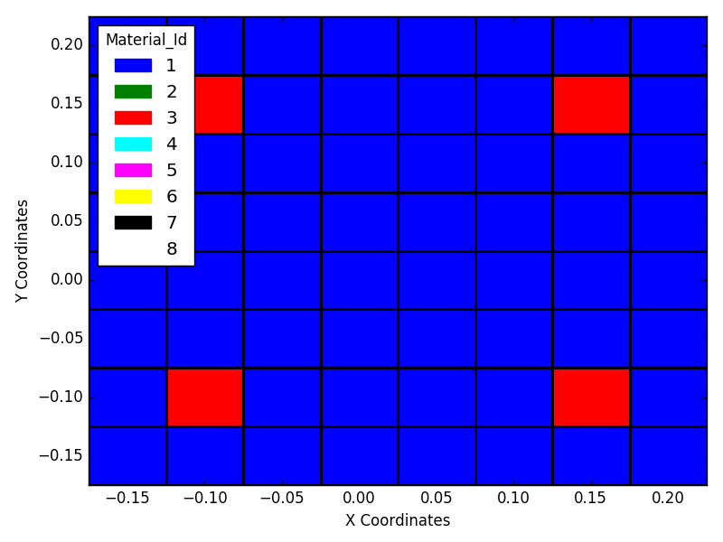

# REAL-ESSI_Utility_Tools

### Usage

It contains a lot of frequently used codes that I have developed over time 
to my post/pre processing easy for Real-ESSI input and output files respectively


### Plot_Cross_Section.py
It is used to plot crossection of all sections while using Beam-Fiber element 

#####Synatx 

```script
python Plot_Cross_Section.py < filename >
```

#####Example 

```script
python Plot_Cross_Section.py Examples/Square_RC_Column.fei
```

